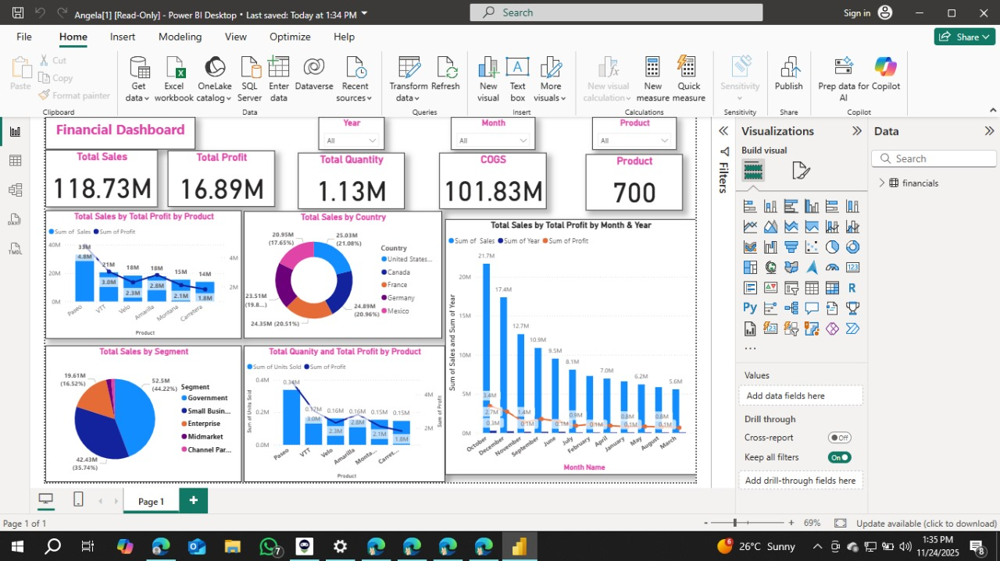

# 📊 Financial Power BI Dashboard

An interactive and visually rich **Financial Performance Dashboard** built using **Power BI** to analyze sales, profits, COGS, customer segments, products, and regional performance.

---

## 🖼️ Dashboard Preview

---

## 🚀 Key KPIs Displayed

| KPI | Value |
|-----|-------|
| 💰 Total Sales | 118.73M |
| 📈 Total Profit | 16.89M |
| 📦 Total Quantity | 1.13M |
| 🧾 COGS | 101.83M |
| 🛍️ Total Products | 700 |

---

## 📌 Insights & Charts Included

The dashboard delivers deep-dive analytics using multiple visualizations:

- 📊 **Sales & Profit by Product** (bar chart)
- 🌍 **Sales by Country** (donut chart)
- 🧩 **Sales by Segment** (pie chart)
- 📅 **Sales Trend by Month & Year** (clustered column + line chart)
- 🔁 **Quantity / Profit by Product Comparison** (dual-axis chart)
- 🔽 **Interactive filters** — Year, Month, Product

All elements support drill-down and cross-filtering for faster insights.

---

## 🗂️ Project File

| File | Description |
|------|-------------|
| `Angela.pbix` | Main Power BI dashboard file |

---

## ⚙️ Technologies Used

| Tech | Purpose |
|------|---------|
| Power BI Desktop | Data visualization & report creation |
| DAX | KPI calculations |
| Data Modeling | Relationships and measures |
| Business Intelligence | Decision-support insights |

---

## 🔮 Future Enhancements

- YoY growth and MoM % change visualizations
- RLS (Row-Level Security)
- Auto-refresh & workspace deployment on Power BI Service
- Mobile layout optimization

---

## 🤝 Contributing

Contributions are welcome!

1. Fork the repository  
2. Create a new branch  
3. Commit your changes  
4. Open a Pull Request  
